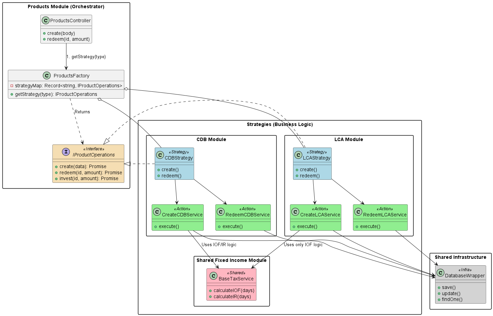

# Documentação de Arquitetura: Sistema de Produtos Financeiros (Modular Strategy)

## Índice
1. [Escolha de Tecnologia](#1-escolha-de-tecnologia)
2. [Conceitos e Definições](#2-conceitos-e-definições)
3. [Estrutura Proposta](#3-estrutura-proposta)
4. [Justificativa da Estrutura](#4-justificativa-da-estrutura)
5. [Relação com Arquitetura Hexagonal (Clean Architecture) e Simplificações](#5-relação-com-arquitetura-hexagonal-clean-architecture-e-simplificações)
6. [Exemplo de Implementação](#6-exemplo-de-implementação)
7. [CLI NestJS: Geração de Módulos e Serviços](#7-cli-nestjs-geração-de-módulos-e-serviços)
8. [Guia Operacional: Adição de um Novo Produto (LCA)](#8-guia-operacional-adição-de-um-novo-produto-lca)
9. [Adendo A: Otimização de Boilerplate com Custom Providers](#9-adendo-a-otimização-de-boilerplate-com-custom-providers)

---

## 1. Escolha de Tecnologia
**Framework**: NestJS (Node.js/TypeScript).

**Motivação**: A escolha pelo NestJS deve-se à sua capacidade nativa de Injeção de Dependência (DI) e ao seu sistema modular hierárquico. Tais características permitem a implementação de padrões de projeto complexos de forma limpa, com a manutenção da tipagem forte do TypeScript.

**Gestão de Dependências**: O container do NestJS é utilizado para gerenciar o ciclo de vida das classes, o que evita acoplamento forte e facilita a criação de testes unitários via mocks.

## 2. Conceitos e Definições
Para solucionar o problema de classes de grande porte ("God Classes") e lógica de negócios acoplada, foram adotados os seguintes padrões:

- **Strategy Pattern (Estratégia)**: Define que cada produto (CDB, LCI) é uma estratégia isolada que implementa um contrato comum (interface). O sistema não reconhece tipos de produto específicos como "CDB", mas sim a interface `IOperacoesProduto`.

- **Abstract Factory (Fábrica)**: Um serviço central (`FabricaProdutos`) decide qual estratégia instanciar com base em um identificador (ex: 'CDB'), removendo a lógica de decisão dos Controllers.

- **Actions (Ações/Serviços Unitários)**: Em vez de uma classe monolítica como `CdbService`, cada operação é segregada em um arquivo próprio (ex: `ResgatarCdbService`, `CriarCdbService`), em conformidade com o Princípio da Responsabilidade Única (SRP).

- **Facade (Facade)**: A classe de Estratégia (ex: `EstrategiaCdb`) atua como um ponto de acesso central, delegando a execução para a Ação correspondente sem executar a regra de negócio diretamente.

- **Módulo Compartilhado (Shared Logic)**: Lógica reutilizável (ex: cálculo de IOF para renda fixa) é isolada em um módulo compartilhado (`comum-renda-fixa`) e injetada onde necessário, em respeito ao princípio DRY (Don't Repeat Yourself).

## 3. Estrutura Proposta
A estrutura separa a infraestrutura (banco de dados, logs) da regra de negócio e organiza o domínio por produto específico.



```plaintext
src/
├── compartilhado/                  # 🛠️ INFRAESTRUTURA (Agnóstico)
│   ├── banco-dados/
│   │   ├── adaptador-banco.service.ts  # Wrapper (ex: Prisma/TypeORM)
│   │   └── banco-dados.module.ts
│
└── modulos/
    └── produtos/                   # 📦 MÓDULO ORQUESTRADOR
        ├── produtos.controller.ts  # Entrada API
        ├── produtos.module.ts
        │
        ├── interfaces/
        │   └── operacoes-produto.interface.ts  # Contrato Global
        │
        ├── fabrica/
        │   └── fabrica-produtos.service.ts  # Roteador Lógico
        │
        └── estrategias/
            │
            ├── comum-renda-fixa/       # 🧩 LÓGICA COMPARTILHADA
            │   ├── servicos/
            │   │   └── calculo-imposto.service.ts
            │   └── comum-renda-fixa.module.ts
            │
            ├── cdb/                    # 📦 PRODUTO: CDB
            │   ├── acoes/              # Lógica Granular
            │   │   ├── criar-cdb.service.ts
            │   │   ├── resgatar-cdb.service.ts
            │   │   ├── aportar-cdb.service.ts
            │   │   └── index.ts
            │   ├── estrategia-cdb.service.ts  # Facade
            │   └── cdb.module.ts
            │
            └── lci/                    # 📦 PRODUTO: LCI
                ├── acoes/
                │   ├── criar-lci.service.ts
                │   └── resgatar-lci.service.ts
                ├── estrategia-lci.service.ts
                └── lci.module.ts
```

## 4. Justificativa da Estrutura

- **Manutenibilidade Cognitiva**: Um desenvolvedor que precisa corrigir um bug no "Resgate de CDB" pode ir diretamente ao arquivo `resgatar-cdb.service.ts`, sem precisar analisar o código de criação ou de outros produtos. O contexto é isolado.
- **Segurança de Alteração**: Alterar a regra da LCI não apresenta risco de impactar o CDB, pois os módulos estão fisicamente separados.
- **Reuso Inteligente**: O módulo `comum-renda-fixa` permite que regras governamentais (IOF, IR) sejam alteradas em um único local e aplicadas a todos os produtos que utilizam essa lógica.
- **Testabilidade**: O teste de uma "Action" pequena é trivial, pois não é necessário mockar todo o sistema, apenas as dependências daquela ação específica.

## 5. Relação com Arquitetura Hexagonal (Clean Architecture) e Simplificações
A arquitetura adota uma abordagem pragmática baseada na Clean Architecture.

**Princípios da Arquitetura Hexagonal aplicados:**

- **Inversão de Dependência**: As regras de negócio (ex: `cdb/acoes`) não dependem diretamente do banco de dados, mas sim de uma abstração (`AdaptadorBancoService`). Isso permite que a fonte de dados (ex: Postgres, Mongo) seja substituída sem impactar a lógica de negócio.
- **Independência de Framework (Conceitual)**: Embora a implementação utilize decorators do NestJS (`@Injectable`), a lógica contida nos métodos é focada no domínio e escrita em TypeScript/JavaScript puro.

**Simplificações Adotadas:**

- **Remoção de Camadas de DTOs e Mappers**: Foram omitidas as criações de DTOs específicos para "Entrada de Caso de Uso" e "Saída de Caso de Uso". Em vez disso, são utilizadas as entidades de domínio e os DTOs de validação do NestJS, o que reduz o código repetitivo (boilerplate).
- **Uso de Módulos como Contextos Delimitados**: Os Módulos do NestJS são utilizados para representar os "Bounded Contexts" da arquitetura, aproveitando os recursos do framework.

## 6. Exemplo de Implementação
### 6.1. Interface (Contrato)
Define o que o sistema espera de qualquer produto.

```typescript
// src/modulos/produtos/interfaces/operacoes-produto.interface.ts
export interface IOperacoesProduto {
  criar(dados: any): Promise<any>;
  resgatar(id: string, valor: number): Promise<any>;
  aportar(id: string, valor: number): Promise<any>;
}
```

### 6.2. Lógica Compartilhada (Reuso)
```typescript
// src/modulos/produtos/estrategias/comum-renda-fixa/servicos/calculo-imposto.service.ts
@Injectable()
export class CalculoImpostoService {
  calcularIOF(dias: number): number {
    return dias < 30 ? 0.05 : 0;
  }
}
```

### 6.3. Ação Específica (CDB - Resgate)
```typescript
// src/modulos/produtos/estrategias/cdb/acoes/resgatar-cdb.service.ts
@Injectable()
export class ResgatarCdbService {
  constructor(
    private banco: AdaptadorBancoService, // Infra
    private impostos: CalculoImpostoService // Lógica Compartilhada
  ) {}

  async executar(id: string, valor: number) {
    const produto = await this.banco.buscar(id);
    
    // Regra específica do CDB: Tem IR regressivo
    const dias = this.calcularDias(produto.dataAporte);
    const imposto = this.impostos.calcularIOF(dias); 
    
    // ... lógica de atualização de saldo ...
  }
}
```

### 6.4. A Estratégia (Facade)
```typescript
// src/modulos/produtos/estrategias/cdb/estrategia-cdb.service.ts
@Injectable()
export class EstrategiaCdb implements IOperacoesProduto {
  constructor(
    private criador: CriarCdbService,
    private resgatador: ResgatarCdbService,
    private aportador: AportarCdbService
  ) {}

  // Delegação simples
  async criar(d) { return this.criador.executar(d); }
  async resgatar(id, v) { return this.resgatador.executar(id, v); }
  async aportar(id, v) { return this.aportador.executar(id, v); }
}
```

### 6.5. A Fábrica (Factory)
```typescript
// src/modulos/produtos/fabrica/fabrica-produtos.service.ts
@Injectable()
export class FabricaProdutos {
  private mapa: Record<string, IOperacoesProduto> = {};

  constructor(
    private cdb: EstrategiaCdb,
    private lci: EstrategiaLci
  ) {
    this.mapa['CDB'] = cdb;
    this.mapa['LCI'] = lci;
  }

  obter(tipo: string): IOperacoesProduto {
    return this.mapa[tipo.toUpperCase()];
  }
}
```

## 7. CLI NestJS: Geração de Módulos e Serviços
Os arquivos e diretórios da estrutura podem ser gerados por meio dos comandos do NestJS CLI. Isso assegura que as dependências e importações sejam configuradas corretamente pelo framework.

**1. Base Comum e Compartilhada:**
```bash
nest g module modulos/produtos/estrategias/comum-renda-fixa
nest g service modulos/produtos/estrategias/comum-renda-fixa/servicos/calculo-imposto --flat --no-spec
```

**2. Produto CDB (Módulo + Estratégia + Ações):**
```bash
nest g module modulos/produtos/estrategias/cdb
nest g service modulos/produtos/estrategias/cdb/estrategia-cdb --flat --no-spec
# Ações
nest g service modulos/produtos/estrategias/cdb/acoes/criar-cdb --flat --no-spec
nest g service modulos/produtos/estrategias/cdb/acoes/resgatar-cdb --flat --no-spec
nest g service modulos/produtos/estrategias/cdb/acoes/aportar-cdb --flat --no-spec
```

**3. Produto LCI (Módulo + Estratégia + Ações):**
```bash
nest g module modulos/produtos/estrategias/lci
nest g service modulos/produtos/estrategias/lci/estrategia-lci --flat --no-spec
# Ações
nest g service modulos/produtos/estrategias/lci/acoes/criar-lci --flat --no-spec
nest g service modulos/produtos/estrategias/lci/acoes/resgatar-lci --flat --no-spec
```

## 8. Guia Operacional: Adição de um Novo Produto (LCA)
Este roteiro descreve o processo para introduzir o produto **LCA (Letra de Crédito do Agronegócio)** na arquitetura. Presume-se que a execução dos comandos ocorre na raiz do projeto e que os módulos base já existem.

---

### Passo 1: Gerar a Estrutura de Arquivos (CLI)

O Nest CLI deve ser utilizado para garantir que os arquivos sejam criados e configurados corretamente.

**1.1. Criar o Sub-módulo da LCA**
Este comando cria o diretório `lca` e o arquivo de módulo.
```bash
nest g module modulos/produtos/estrategias/lca
```

**1.2. Criar a Facade (Estratégia)**
Cria o serviço principal que será a "cara" do produto.
- `--flat`: Cria o arquivo na raiz do diretório `lca`.
- `--no-spec`: Pula a criação do arquivo de teste.
```bash
nest g service modulos/produtos/estrategias/lca/estrategia-lca --flat --no-spec
```

**1.3. Criar as Ações (Lógica de Negócio)**
Cria os serviços especialistas no diretório `acoes`.
```bash
nest g service modulos/produtos/estrategias/lca/acoes/criar-lca --flat --no-spec
nest g service modulos/produtos/estrategias/lca/acoes/resgatar-lca --flat --no-spec
```

### Passo 2: Implementar a Ação de Criação
A seguir, define-se como a LCA é criada, usando o cálculo de IOF padrão, mas com isenção de IR.

**Arquivo para editar**: `src/modulos/produtos/estrategias/lca/acoes/criar-lca.service.ts`
```typescript
import { Injectable } from '@nestjs/common';
import { AdaptadorBancoService } from '../../../../../compartilhado/banco-dados/adaptador-banco.service';
import { CalculoImpostoBaseService } from '../../comum-renda-fixa/servicos/calculo-imposto-base.service';

@Injectable()
export class CriarLcaService {
  constructor(
    private banco: AdaptadorBancoService,
    // INJEÇÃO DO MÓDULO COMPARTILHADO (REUSO)
    private impostos: CalculoImpostoBaseService 
  ) {}

  async executar(dados: any) {
    // 1. Reutiliza regra de IOF da Renda Fixa
    const iof = this.impostos.calcularIOF(dados.prazoDias);

    // 2. Regra Específica LCA: Isenção de IR
    const ir = 0; 

    const payload = {
      ...dados,
      iof,
      ir,
      tipo: 'LCA',
      dataCriacao: new Date()
    };

    return this.banco.salvar('produtos', payload);
  }
}
```

### Passo 3: Implementar a Ação de Resgate
Define-se a regra de trava de liquidez (Carência de 90 dias).

**Arquivo para editar**: `src/modulos/produtos/estrategias/lca/acoes/resgatar-lca.service.ts`
```typescript
import { Injectable, BadRequestException } from '@nestjs/common';
import { AdaptadorBancoService } from '../../../../../compartilhado/banco-dados/adaptador-banco.service';

@Injectable()
export class ResgatarLcaService {
  constructor(private banco: AdaptadorBancoService) {}

  async executar(id: string, valor: number) {
    const produto = await this.banco.buscarPorId('produtos', id);

    // 1. Regra de Negócio: Validação de Carência (90 dias)
    const diasCorridos = this.calcularDias(produto.dataCriacao);
    if (diasCorridos < 90) {
      throw new BadRequestException('Resgate bloqueado: Carência legal de 90 dias para LCA.');
    }

    if (produto.saldo < valor) {
      throw new BadRequestException('Saldo insuficiente.');
    }

    // 2. Atualização
    return this.banco.atualizar('produtos', id, {
      saldo: produto.saldo - valor
    });
  }

  private calcularDias(data: Date): number {
    // Implementação simples de diferença de dias
    const diff = new Date().getTime() - new Date(data).getTime();
    return Math.ceil(diff / (1000 * 3600 * 24)); 
  }
}
```

### Passo 4: Implementar a Estratégia (Facade)
As ações são então conectadas à interface padrão do sistema.

**Arquivo para editar**: `src/modulos/produtos/estrategias/lca/estrategia-lca.service.ts`
```typescript
import { Injectable, NotImplementedException } from '@nestjs/common';
import { IOperacoesProduto } from '../../interfaces/operacoes-produto.interface';
import { CriarLcaService } from './acoes/criar-lca.service';
import { ResgatarLcaService } from './acoes/resgatar-lca.service';

@Injectable()
export class EstrategiaLca implements IOperacoesProduto {
  constructor(
    private criador: CriarLcaService,
    private resgatador: ResgatarLcaService
  ) {}

  // OBRIGATÓRIO: Implementar o contrato da interface
  async criar(dados: any) {
    return this.criador.executar(dados);
  }

  async resgatar(id: string, valor: number) {
    return this.resgatador.executar(id, valor);
  }

  async aportar(id: string, valor: number) {
    // Exemplo: LCA não permite aporte adicional, só nova compra
    throw new NotImplementedException('LCA não permite aportes adicionais.');
  }
  
  async calcularCotacao(id: string) {
     return 1; // Unitário fixo
  }
}
```

### Passo 5: Configurar o Módulo da LCA
É necessário exportar a estratégia e importar as dependências (Banco e Lógica Comum).

**Arquivo para editar**: `src/modulos/produtos/estrategias/lca/lca.module.ts`
```typescript
import { Module } from '@nestjs/common';
import { EstrategiaLca } from './estrategia-lca.service';
import { CriarLcaService } from './acoes/criar-lca.service';
import { ResgatarLcaService } from './acoes/resgatar-lca.service';
import { SharedModule } from '../../../../compartilhado/shared.module'; // Banco
import { ComumRendaFixaModule } from '../comum-renda-fixa/comum-renda-fixa.module'; // CalculoImposto

@Module({
  imports: [
    SharedModule,         
    ComumRendaFixaModule  
  ],
  providers: [
    EstrategiaLca,    // Facade
    CriarLcaService,  // Interno (Privado)
    ResgatarLcaService // Interno (Privado)
  ],
  exports: [
    EstrategiaLca     // 🚨 IMPORTANTE: Apenas a estratégia é exportada
  ]
})
export class LcaModule {}
```

### Passo 6: Registrar no Módulo Principal
O `ProdutosModule` precisa ser informado sobre a existência do `LcaModule`.

**Arquivo para editar**: `src/modulos/produtos/produtos.module.ts`
```typescript
import { Module } from '@nestjs/common';
import { LcaModule } from './estrategias/lca/lca.module'; // <--- Importar
// ... outros imports

@Module({
  imports: [
    // ... outros módulos
    LcaModule // <--- Adicionar ao array de imports
  ],
  controllers: [ProdutosController],
  providers: [FabricaProdutos]
})
export class ProdutosModule {}
```

### Passo 7: Mapear na Fábrica
O último passo é configurar a `FabricaProdutos` para rotear as chamadas do tipo "LCA" para a nova classe.

**Arquivo para editar**: `src/modulos/produtos/fabrica/fabrica-produtos.service.ts`
```typescript
import { Injectable } from '@nestjs/common';
import { EstrategiaLca } from '../estrategias/lca/estrategia-lca.service';
// ... imports

@Injectable()
export class FabricaProdutos {
  private mapa: Record<string, IOperacoesProduto> = {};

  constructor(
    private cdb: EstrategiaCdb,
    private lca: EstrategiaLca // 1. INJETAR A NOVA ESTRATÉGIA
  ) {
    this.mapa['CDB'] = cdb;
    
    // 2. REGISTRAR NO MAPA
    // Agora o sistema aceita { "tipo": "LCA" } no JSON
    this.mapa['LCA'] = lca; 
  }
  
  // ... resto da classe
}
```

# Adendo A: Otimização de Boilerplate com Custom Providers

## 1. Contexto
Na arquitetura padrão apresentada, a classe `EstrategiaCdb` atua como uma **Fachada (Facade)**. Embora útil para encapsulamento, em cenários onde ela apenas repassa a chamada para as Actions (`return this.action.execute()`), ela se torna uma "classe casca" (boilerplate desnecessário).

Este adendo propõe uma **forma avançada** de declarar estratégias usando o recurso `useFactory` do NestJS, eliminando o arquivo físico da estratégia e definindo o comportamento diretamente na montagem do módulo.

---

## 2. A Mudança Estrutural

### Como era (Abordagem Clássica)
Havia um arquivo físico `estrategia-cdb.service.ts` que precisava ser criado, testado e mantido apenas para fazer o "wiring" (ligação).

```text
src/modulos/produtos/estrategias/cdb/
├── acoes/                  # Lógica Real
│   ├── criar-cdb.service.ts
│   └── resgatar-cdb.service.ts
├── estrategia-cdb.service.ts  ❌ (REMOVIDO NESTA ABORDAGEM)
└── cdb.module.ts
```
### Como fica (Abordagem Otimizada)
A estratégia passa a ser um Objeto Dinâmico montado dentro do cdb.module.ts.

2.1. Ajuste no Módulo do Produto (cdb.module.ts)
Em vez de declarar uma classe nos providers, usamos um Factory Provider.

```typescript
import { Module } from '@nestjs/common';
import { CriarCdbService } from './acoes/criar-cdb.service';
import { ResgatarCdbService } from './acoes/resgatar-cdb.service';
import { IOperacoesProduto } from '../../interfaces/operacoes-produto.interface';

// 1. Definimos um TOKEN único para injeção
export const CDB_STRATEGY_TOKEN = 'TOKEN_ESTRATEGIA_CDB';

@Module({
  imports: [ /* ... Módulos compartilhados ... */ ],
  providers: [
    CriarCdbService,    // Ação (Provider Simples)
    ResgatarCdbService, // Ação (Provider Simples)

    // 2. A Mágica: Criamos a estratégia dinamicamente
    {
      provide: CDB_STRATEGY_TOKEN,
      useFactory: (
        criador: CriarCdbService, 
        resgatador: ResgatarCdbService
      ): IOperacoesProduto => { // O TypeScript garante que o objeto respeite a interface
        
        return {
          // Mapeamos os métodos da interface para as Actions
          criar: (dados) => criador.executar(dados),
          
          resgatar: (id, valor) => resgatador.executar(id, valor),
          
          // Podemos implementar métodos simples inline, sem criar arquivos
          aportar: async () => { throw new Error('CDB não suporta aporte nesta versão'); },
          
          calcularCotacao: async () => 1
        };
      },
      // Injetamos as dependências necessárias para a factory funcionar
      inject: [CriarCdbService, ResgatarCdbService],
    },
  ],
  // Exportamos o Token para que a Fábrica possa usar
  exports: [CDB_STRATEGY_TOKEN] 
})
export class CdbModule {}
```
2.2. Ajuste na Fábrica (fabrica-produtos.service.ts)
A fábrica agora injeta o token, não mais uma classe.

```typescript
import { Inject, Injectable } from '@nestjs/common';
import { IOperacoesProduto } from '../interfaces/operacoes-produto.interface';
import { CDB_STRATEGY_TOKEN } from '../estrategias/cdb/cdb.module';

@Injectable()
export class FabricaProdutos {
  private mapa: Record<string, IOperacoesProduto> = {};

  constructor(
    // Usamos o decorator @Inject com o Token exportado pelo módulo
    @Inject(CDB_STRATEGY_TOKEN) private estrategiaCdb: IOperacoesProduto
  ) {
    this.mapa['CDB'] = estrategiaCdb;
  }
  
  // O resto da classe permanece idêntico
}
```

## 3. Prós e Contras da Troca


| Característica | Abordagem Clássica (Classe) | Abordagem Otimizada (useFactory) |
|---|---|---|
| **Arquivos** | Mais arquivos (`.service.ts` extra). | Menos arquivos (Definição no Módulo). |
| **Legibilidade** | Explícita. Fácil para juniores. | Mais densa. Exige conhecimento de DI do NestJS. |
| **Boilerplate** | Alto (Repetição de métodos delegados). | Baixo (Mapeamento direto objeto-função). |
| **Refatoração** | Alterar a interface exige mexer no arquivo da classe. | Alterar a interface exige mexer no `module.ts`. |